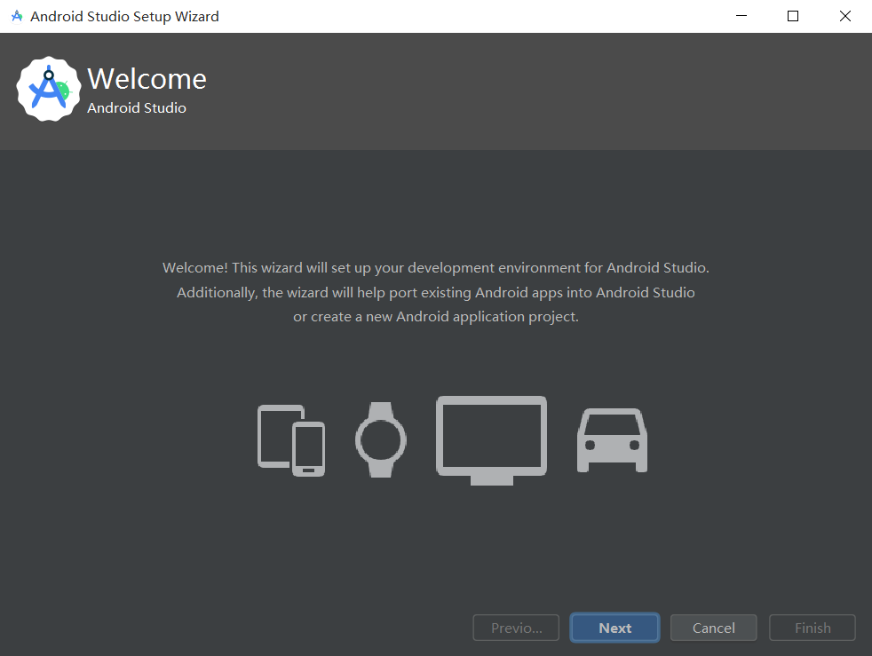
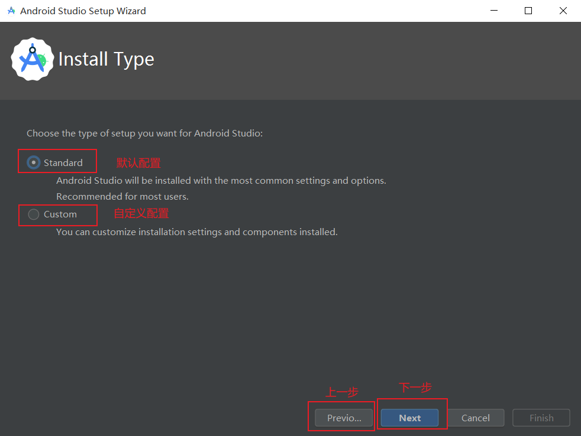

# Android Studio 安装教程

本文提供了 Android Studio 安装图文教程

更多详细信息可参考官方教程： [安装 Android Studio](https://developer.android.google.cn/studio/install?hl=zh-cn#windows)

## windows 平台教程

 

### 1. 下载 Android Studio 安装程序

前往 [Android Studio 官网](https://developer.android.google.cn/studio?hl=zh-cn) ，并点击 `下载 Android Studio Giraffe` 按钮。

在弹出的条款及条件界面中阅读并在底部勾选 `我已阅读并同意上述条款及条件` ，点击 `下载 Android Studio Giraffe | xxxx.xx.xx xxx x
 适用平台： Windows` 即可下载

### 2. 安装 Android Studio

打开上一步下载的 Android Studio 安装程序：`android-studio-xxxx.xx.xx-windows.exe`

等待安装程序进入 `Android Studio Setup` 后，点击 `Next` 按钮开始安装

此处安装程序提示选择需要安装的组件

第一个是 `Android Studio` 本体，第二个是 安卓虚拟设备

如果你开发时不需要  安卓虚拟设备可以取消勾选 `Android Virtual Device`

点击 `Next` 按钮进入下一步

该界面选择 `AndroidStudio` 的安装位置

点击 `Next` 按钮进入下一步

该界面选择 `AndroidStudio` 的开始菜单文件夹

点击 `Install` 按钮开始安装

等待安装成功，点击`Next` 进入下一步

### 3. 首次启动

::: warning 网络代理服务

国内用户需要有网络代理服务以下载依赖

:::

你可能会遇到以下界面：

是否向 `Android Studio` 发送隐私数据，以帮助改进 `Android Studio`

导入设置配置文件

出现此界面代表无法访问 SDK 服务器，网络问题，请检查你电脑的代理设置

点击 `Setup Proxy` 设置代理

### 4. 配置开发环境

进入此界面是 `AndroidStudio` 配置开发环境的向导，按照向导指引即可成功配置开发环境

点击 `Next` 进入下一步

选择安装配置和组件，推荐选择 `Standard` , 点击 `Next` 进入下一步

进入此界面，此界面展示了默认配置所需下载的依赖和组件，以及大小，点击 `Finish` 进入开始下载安装 依赖和组件

进入此界面，正在下载安装依赖和组件，此过程可能要数十分钟，取决与你的代理和网络，耐心等待

如果出现下方报错，代表你的电脑 `cpu` 可能未开启或不支持 `VT-x` , `VT-x` 功能是运行安卓虚拟机的必要功能，你可以在网络上找到各个品牌电脑`VT-x`开启方式

安装完成后将会自动进入该界面

至此 `Android Studio` 已安装完毕

## macos 平台教程

...
